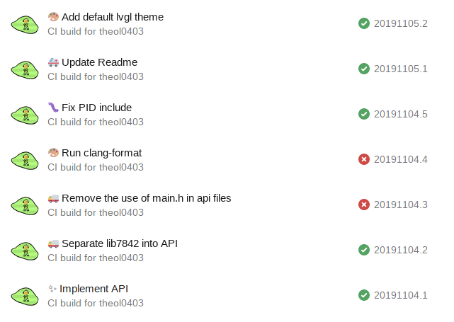
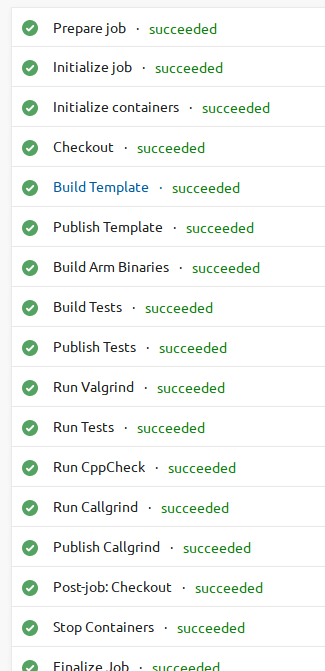

# Robot GUI

A large part of lib7842 is the GUI.  It uses a third-party graphics library named LVGL for the elements. The GUI is fully tested and developed on my computer using a simulator, so that I don't need to have a V5 brain handy.

Here is a screenshots of the GUI:

# Tests

I use Microsoft Azure for tests and CI. Here are some screenshots of that:

 