<!-- prettier-ignore-start -->
## Table of contents
{: .no_toc .text-delta }
1. TOC 
{:toc}

<!-- prettier-ignore-end -->

## Introduction

Hello everyone!

I'm Theo from 7842F, and I'm the programmer for our team.

I've been meaning to make this post ever since worlds, but I haven't had the
time to do so. I now finally have some time before my school starts (I still
have 1 week of summer) to show the VEX community our robot and all the different
designs we have implemented to make it.

Even though the Turning Point season is way over, the things I will show in this
post still applies to this year and VEX in general.

## Who Are We?

7842F is a 2-person team from Vancouver Island, Canada. We meet to build twice a
week for ~4 hours, and we design and program at home. We are not allowed to take
our robots home, so we try to be as organized and efficient as possible with the
time we have to build. Our team captain is Jacob Walter, and he did pretty much
all the designing, cadding, building, documentation, journals, and driving. I
did all the programming, helped with building, made our website, and was a
partner driver at worlds.

## Video Explanation/Demo

I recorded a brief video a while ago demonstrating our robot. The following post
will cover in more detail the designs that went into each system.

<https://www.youtube.com/watch?v=iW4RlnHbDrY>

# Flywheel Velocity Control

Throughout the TP season, we stuck with a flywheel design. We improved and
upgraded it through the year, and gained a lot of knowledge about using it. We
went through 3 different flywheel designs. The first was a 1m back-loading
simple flywheel, the second a 2m front-loading indexed flywheel, and the last a
2m front loading angling flywheel.

In all our designs, we needed to be able to control the flywheel speed as
precisely and consistently as possible. It was also crucial that the flywheel
was able to regain its speed as fast as possible after a ball was shot. Since we
were using the Cortex system during the development of our flywheel control
system, we were able to take advantage of RobotC’s amazing debugger system and
graph our flywheel performance.


## Traditional Control

First of all, we tried “traditional” velocity pid control. This is usually what
is taught in control theory, and is implemented as `output += pid(...);`. This
means that the motor power being sent to the flywheel is being tweaked
incrementally each step by a PID controller.

The issue with this method is that a flywheel is very unresponsive, so the PID
would ramp up the motor power much too high, and then the flywheel would
overshoot, and then the PID would take a long time to get the flywheel to reach
the goal. If we tried to lower the PID gains, the flywheel would be too sluggish
and take much too long to react.

This is the velocity PID algorithm used in V5 Motors, OkapiLib, and most
velocity PID controllers.

## Custom Algorithm - Feedforward

I decided to scrap that algorithm and try to make my own. First, I wanted
something that given a target RPM would know right away the general voltage that
needed to be sent to the motor.

I did this by introducing a new term named feedforward. Feedforward is simply
`target * kF`, in other words, the higher the target velocity, the
proportionally higher the output power. When kF is tuned right, it can bring the
flywheel to the approximate ballpark velocity, assuming linear flywheel velocity
to input voltage.

For example, if the target is 2800rpm, and kF is tuned for our early-season
flywheel, it would output 90 power. This is the term that does most of the grunt
work involved with moving the flywheel.

Using feedforward, I could then implement my PID as `output = pidf(...);`

## Accuracy

However, feedforward can’t do all the work. The velocity might not be linear to
output power, or there may be some friction or other interference. This is where
P (Proportional) comes in. P, supported by F, does the rest of the work by
nudging the flywheel power in the right direction to completely reach the goal.
For this to work, P must be very high, leading to another problem: oscillation.

The signal coming in from flywheel velocity calculations are quite noisy if you
want them to be up-to-date. When the algorithm sees this noise, and kP is high,
this translates to noise in the output signal. This means the motor starts
oscillating, which translates to real flywheel oscillation. This translates into
an even more noisy signal going into the PID, causing a vicious cycle of
oscillation.


## Signal EMA Filtering

To solve this issue, the input signal needs to be smoothed. For this, I use an
EMA (Exponential Moving Average) filter.

<https://en.wikipedia.org/wiki/Moving_average>

EMA takes the flywheel reading over time and strikes a balance between taking
into account the new reading and keeping the old one. If you overuse EMA, it
will cause the signal to be unresponsive and outdated, causing more oscillation,
so it is important to use just the right amount to smooth noise.

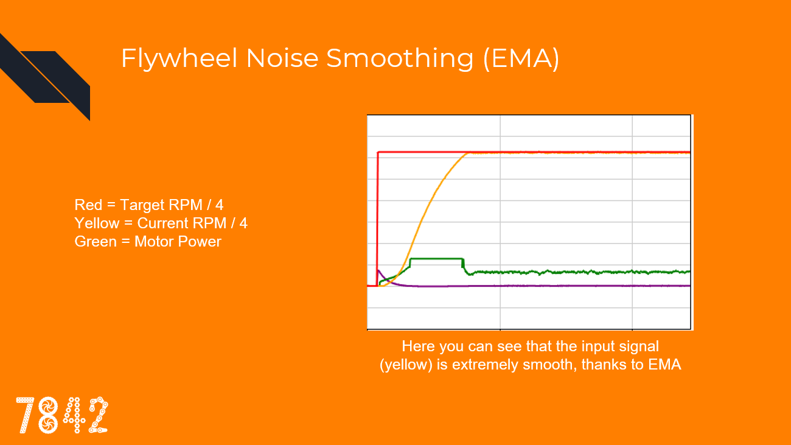

Now that EMA causes the input signal to be smooth, the output power will also be
steady. This is exactly what we want when controlling a flywheel: smooth, steady
power. Now that the input noise and oscillations are damped and filtered out, I
can use a large kP gain to be as precise as possible without fearing
oscillation.

Note: I could also try to use the I term for more accuracy, but I have not had a
good experience with it, as it likes to introduce a lot of oscillations into the
system. In my algorithm, I have not implemented I.

## Derivative EMA Filtering

When the flywheel shoots a ball, I want the flywheel to recover as quickly as
possible, so that the next shot will be consistent. That means I want the motors
to spike to full power _while_ the ball is being shot, not once the flywheel has
slowed down enough for P to kick in. To do this, I use the D (Derivative) term.
D is simply the rate of change of the error, applied to the motors to try to
fight against that rate of change.

I don’t just want the D to kick in while the flywheel is slowing down, I also
want it to linger a bit after the shot to provide an extra boost. To do this, I
also apply an EMA filter on the D. Filtering D is common practice, as it makes D
have time to affect the output instead of being there for only a few timeslices.
Without filtering, it only acts against the change of motion exactly when it
detects it, so in the case of a flywheel, when you shoot a ball, the only effect
D will have is exactly when the flywheel is slowing down. With filtering, D
lingers a bit after the initial high rate of change.

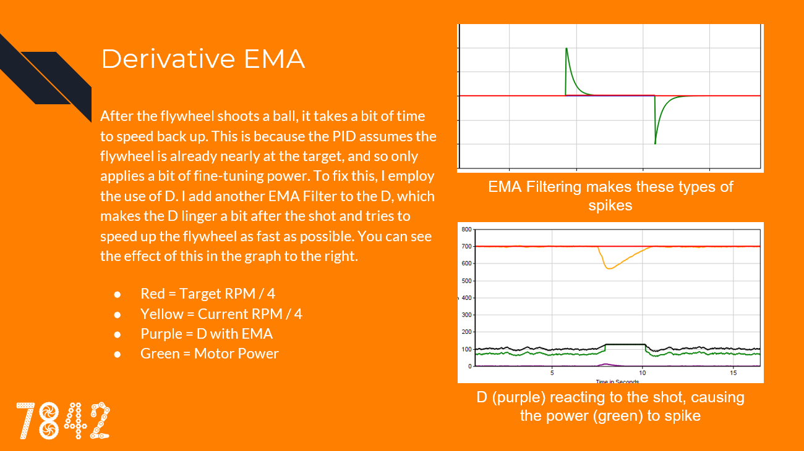

As you can see, using a filtered D allows the flywheel to resume target speed as
fast as possible.

## Slew Rate

Finally, to protect the motors, I apply a one-way slew rate to the output power.
This protects the motors during ramp-up and dampens the system. The flywheel
power can drop very fast, but it needs to gradually climb back up.

If you look at most of the above graphs, you can see that the initial
acceleration of the motor power is gradual. In the following graph, look at how
the motor power (green) is limited and ramps up slowly even though the PID would
have it at full power instantly.

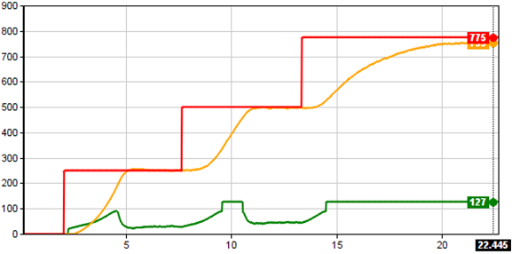

Slew rate can be implemented with a simple algorithm. Here is the pseudocode:

```cpp
increment = output - outputLast;
if(abs(increment) > slewLimit) output = outputLast + slewLimit * sgn(increment);
outputLast = output;
```

## Flywheel Tuning

To properly tune the flywheel constants, I needed a solution that did not
involve redownloading the code every iteration. With RobotC, I could directly
tune the constants using the debugger, but with PROS V5, there is no such tool.
This is why I designed an LVGL tuning utility.

V1: <https://youtu.be/SaY6B3MW3AI>

V2:

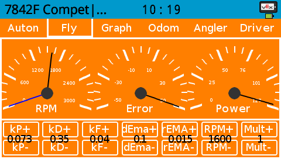

I also made a graphing utility to visualize the flywheel performance:

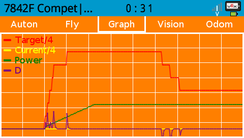

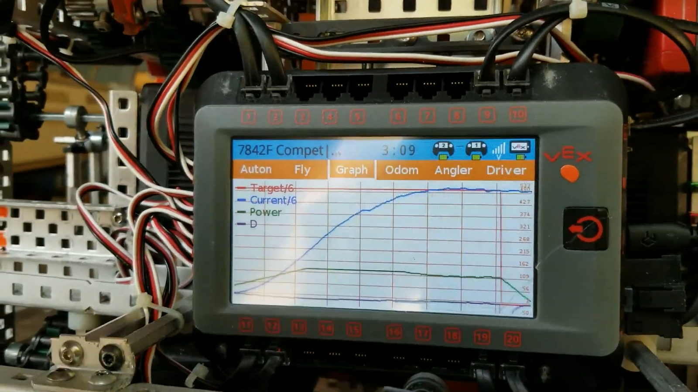

## V5 Flywheel Datalogging

As you may know, the programming solutions V5 do not have any of the remote
debugging features of RobotC. While I did have the GUI graph, I wanted a
solution that could record in the background and report to the computer.

Thus I wrote a utility that saved a log of all the flywheel information in a CSV
on the SD card. Each time the code ran, it would save a log of the flywheel
state. I could then read these files on my computer and import them into
graphing software such as R, Excel, or mathplotlib.

I kept this logger running in competitions and even worlds, so if something
happened to the flywheel we could go back and look at its log, which contained
information like temperature. I recommend using the SD card to store
information, as it can be a useful tool. You can also use a third-party library
to do the CSV writing and file management for you.

## Flywheel Code

I have decided to release the code for this flywheel algorithm!

They are split into 3 parts:

1. EMA Filter
2. Velocity PID with D EMA
3. Implementation with signal EMA and Slew Rate

## RobotC

The files are located in

1. `/Libraries/7842FLib/Filter/emaFilter.c`
2. `/Libraries/7842FLib/PID/PIDEMASystem.c`
3. `/Shared/MainFlywheelTask.c`:

<https://github.com/theol0403/7842F-Alpha-Code-RobotC>

## PROS (V5)

<https://gist.github.com/theol0403/0b484a5a00274edd5b85aa16009ba1ab>

<hr>

# Angling Hood

For our third robot, the one we took to worlds, we made an angling flywheel
hood. It took us months to perfect, but it worked well in the end.

## Double Ratcheting System

Our worlds robot had a 2m flywheel. However, we also wanted a 4m base, an
intake, an indexer, and an arm. To achieve this, we had to use a motor sharing
system. Since the flywheel motors only spin in one direction, we took advantage
of the other direction by using a double ratchet system. We could then power
another subsystem when the motors spun backward. With this system, we were able
to use 2 motors to power our flywheel, indexer, and angler.

We needed smaller and more compact ratchets than was provided by VEX, so Jacob
designed a custom ratchet and submitted it to the CAD online challenge:
<https://challenges.robotevents.com/challenge/94/entry/6325>

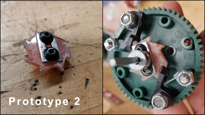

He then expanded that system by making a compact double ratchet.


The angler is ratcheted so it can only be moved forward. When the angler reaches
the maximum position, a slip gear brings the angler back to the resting
position.

## Operation

Here is the flywheel system’s typical routine:

1. Both motors spin CCW and work together to spin up the flywheel
2. When a shooting angle is requested, the angler motor spins CW to engage and
   move the angler, cycling if needed. The indexer motor maintains the
   flywheel’s speed.
3. When the angler is at the desired position, the angler motor resumes powering
   the flywheel.
4. When it is time to shoot, the indexer motor spins CW, engaging the indexer
   and shooting the ball. The angler motor maintains the flywheel’s speed.
5. The indexer motor resumes powering the flywheel.
6. If a doubleshot is selected, the angle for the next flag is requested and
   steps 2-5 repeat
7. Both motors continue powering the flywheel until the next angle adjustment or
   shot

Here are a few clips showing the robot doing double shots:

<https://youtu.be/l6ZdQ_tHcqg>

## Angle Request System

The thing that makes our angler different compared to other angling hoods is
that we can specify the exact angle we want the ball to shoot. To make the most
of this ability, we needed to record the perfect shooting angle for each flag
(top and middle) given various shooting positions.

We decided to have 4 shooting positions:

1. Position 1 is when the angler is all the way back and shoots the top flag
2. Position 2 is with the back of the robot against the platform
3. Position 3 is with the front of the robot against the platform
4. Position 4 is with the back of the robot against the back of the court

If we were on the near starting tile, we could also turn and shoot across the
court using angler position 3 and 4.

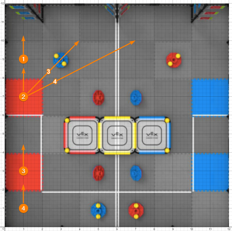

Having these positions tuned allowed us to do some pretty cool shots:


## Driver Interface/Controller Mapping

Having all these different shooting configurations required having a dedicated
driver setting them. Thus I became the partner driver and controlled the angler.

Our workflow was this: the main driver (Jacob) would grab balls, and then head
for any of our 4 shooting positions. He would tell me ahead of time which
position he was planning to shoot at.

I would then press the buttons corresponding to that position, so the angler
would be at the proper position ahead of time so it could be ready to shoot

After the driver lined up for the shot, I would press the shoot button, which
would then execute whatever setting I had specified (top/middle/doubleshot at
what position).

Here is our controller mapping:

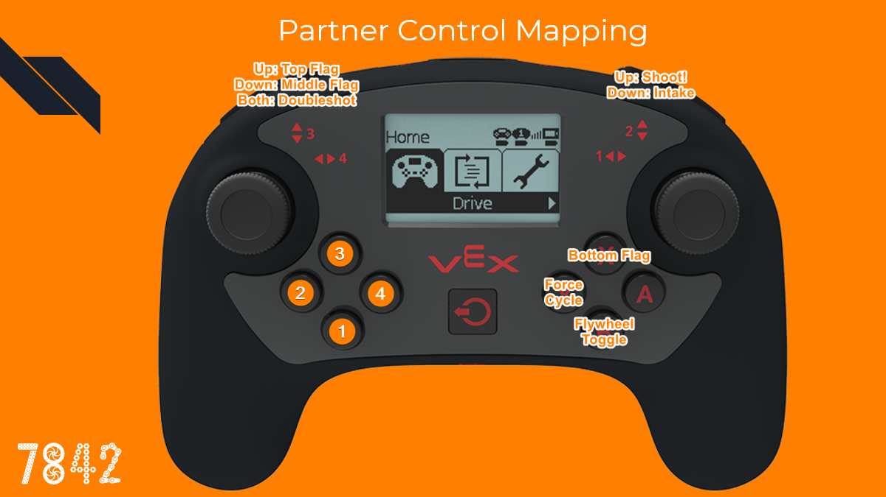

I also have a display on the controller that gives me some useful information:

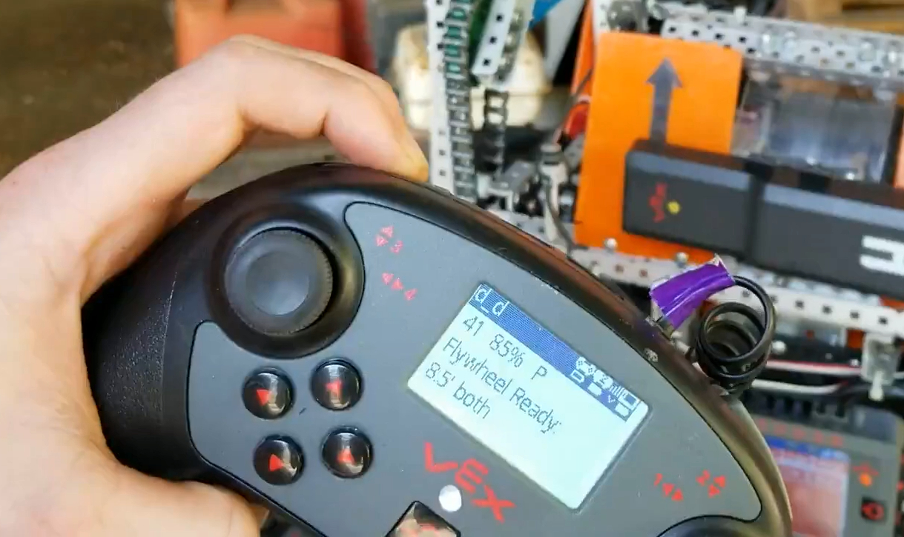

It tells me which distance and which flag is selected, whether the flywheel is
at target velocity, the time left in the match, the robot’s battery, and the
controller ID. This display was useful for driving at competitions. A copy of
this screen is also on the master controller.

## Angle Tuning

To tune the hood angles I experimented with various options. I tried using the
controller buttons to tune the angles and writing logs to the SD or the
terminal, and making a GUI. They all worked to some extent, but the controller
was awkward so I stuck with the GUI option, as it was the most flexible and fast
to use.

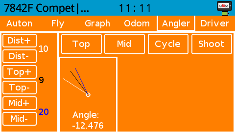

The `Dist` buttons allowed me to control which distance setting to change the
angles for, and the `Top` and `Mid` buttons allowed me to adjust the angles for
that distance. The visualization in the middle of the GUI shows the hood
angles - white is the hood’s current angle, and black and blue are the top and
mid angles, respectively.

## Code Implementation

The angler system was one of the most complicated programs I’ve ever made. It
needed to be able to execute a series of dependent actions, but be asynchronous
and interruptible. It also needed to be able to manage two other systems
(flywheel and indexer) that were independently controlled, delegating motor
ownership between them. It also needed to have a clean outside interface for
drivercontrol and autonomous.

The solution involved making a
[statemachine](https://www.vexforum.com/t/how-to-code-macros-pros/64247/10) that
had a [stack](<https://en.wikipedia.org/wiki/Stack_(abstract_data_type)>)
containing a list of pending actions. Each action would execute until its
conditions were met, and then it would pop itself out of the stack. If an action
needed another action to execute, then it would push that action onto the stack.

Here are all the possible actions the angler could take:

```cpp
enum shootStates {
  off, //control to flywheel and intake
  standby, //back position, control to flywheel
  angling, //indefinite angling
  cycle, //head to back position
  extend, //move to extended position
  waitForSlip, //wait until hood slips
  waitForRetract, //wait until hood back to 0 pos
  angleTop, //drop hood to top angle
  angleMiddle, //drop hood to middle angle
  angleTopPlatform, //angle top from platform
  angleMiddlePlatform, //angle middle from platform
  angleOut, //drop hood to out (ground flag) angle
  angleTarget, //drop hood to target angle
  waitForDoubleShot, //if distance is large enough, wait before second shot
  waitForBall, //wait for ball to be in indexer
  waitForFlywheel, //wait until flywheel is ready
  enableShoot, //shoot indexer
  waitForShoot, //delays until shot detected
  reportDone, //lets autonomous know
  loopJob, //reloads current job
  loopMacro //reloads current macro
};
```

I then defined a collection of “macros”, groups of actions put together in a
sequence:

```cpp
enum class shootMacros {
  off,
  shootTop,
  shootMiddle,
  shootBoth,
  shootTopPlatform,
  shootMiddlePlatform,
  shootBothPlatform,
  shootOut,
  shootTarget,
  shoot,
  angle,
  cycle
};
```

Once I had these self-executing macros set up, I could tell the angler
statemachine to “shootBoth”, and it would execute these actions:

- angleTop
- enableShoot
- angleMiddle
- waitForDoubleShot
- enableShoot
- reportDone
- cycle
- standBy

It was a whole other challenge making the interface between the controller
buttons and the statemachine macros, but I won’t get into that in this post.

Our angler system allowed us to shoot from practically anywhere in the court,
and at worlds we took advantage of this - the large majority of our shots were
taken from behind the platform. It took us a very long time and a lot of work to
develop, but it worked very well in the end.

<hr>

# Odometry/Autonomous

This past year we have developed odometry for our robot. Odometry is the act of
tracking the robot’s position in the court and then using that information for
autonomous routines. Instead of the standard “drive distance, turn angle”, I can
use odometry to say “drive to coordinate, aim at coordinate”. The algorithm for
the tracking was generously provided by
[5225A](https://www.vexforum.com/t/team-5225-introduction-to-position-tracking-document/49640),
but I developed all the infrastructure and movement algorithms.

We used 2 free-spinning tracking wheels on our robot. Tracking wheels are
designed to give the most precision to odometry as possible, as powered wheels
can slip and are not as precise. We opted not to use a third tracking wheel
because we did not have physical space to put it and we didn’t have any extra
sensor ports. If possible I would recommend having a third wheel, as we had some
consistency issues/drift because the tracking wheels would sometimes slide
sideways.

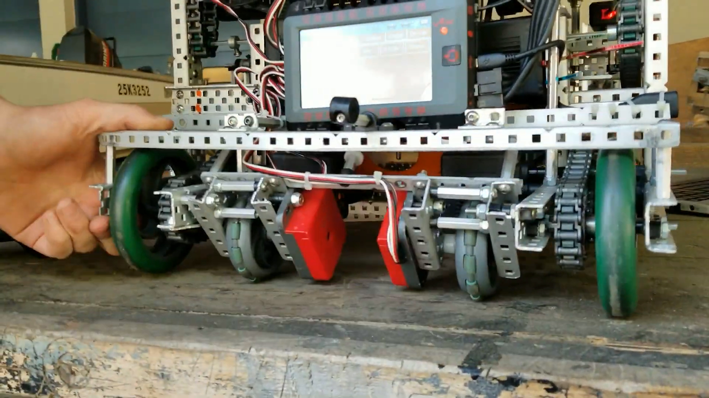

## Odometry Debugging

Odometry is one of the most difficult things to diagnose if something goes
wrong. You don’t know if the wheels failed, if the sensors failed, or if the
code is wrong, and in what way. To help alleviate some of that pain, I wrote a
GUI utility that helped us pinpoint problems.

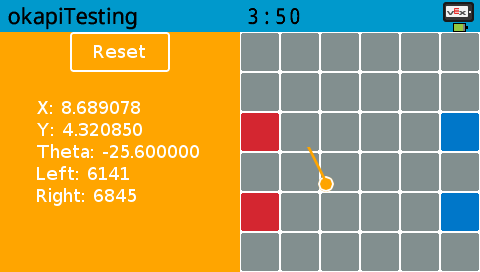

With this, you can try moving the robot in a straight line and see if one sensor
is lagging behind the other, or to see if the tracking algorithm is broken. As a
tool to help others (and as an incentive to help test OkapLib v4’s beta odometry
system), I have published the code for this.

<https://github.com/theol0403/odomDebug>

## Movement

Once you know the position of the robot and where you want to move, the
challenge is to actually move there. Here is a basic algorithm to drive to a
point:

- Calculate angle to target
- Turn to face the target
- Calculate distance to target
- Move distance to reach target

While this algorithm works decently well, it is quite slow and is not able to
dynamically adjust while on-course. I instead wanted to make an algorithm that
would curve toward the target, and calculate course adjustments on the fly.

## PID to heading and distance

The first algorithm that was tried was PID. The distance and angle to the target
would be sent to 2 PID controllers, and then the outputs would be combined.
There were two problems with this method.

The first was that the algorithm had to be terminated when the robot reached the
general vicinity of the target, or else the robot would start having a spasm.
Think about it - PID needs to have a negative input signal to be able to back up
and settle. However, when calculating distance to a point (using pythagoras),
you can’t know when you overshoot the target. Therefore, the robot can only move
forward, so when it reaches **and overshoots** the target, the angle to the
target flips 180 degrees and the distance PID goes full throttle. This causes
the robot to go crazy.

The second problem with this method is that it is not the most efficient. If the
robot was perpendicular to the target, the distance PID would output full power,
even though moving forward is the wrong thing to do.


Instead, I wanted an algorithm that prioritized turning over moving, and that
only moves when doing so would make the robot get nearer to the target.

## Adaptive PID Seeking

I posed this question: “If the robot is locked to its current heading, so it can
only move forward/backward, how can it move in a straight line to get closest to
the point as possible?”.

If the robot was perpendicular to the target, the answer would be 0. But as the
robot rotates to face the target, the answer becomes more and more. Here are
some images illustrating the question (the answer is the length of the red
line):


With the help of others, I was able to implement the math for this. When doing
distance PID on the output of these calculations, the robot was able to move
much more efficiently. I also had to implement some logic to be able to drive
backward. The reason this algorithm works great for settling is that if I turn
off the angle PID when the robot is a certain distance away from the target, the
adaptive distance PID brings the robot to a settled stop, giving a negative
signal to back up.

To test this algorithm, I (with some help) made a javascript simulation. You can
see how the robot prefers turning over driving, and how it settles smoothly.


## Autonomous Code

Once I had the tracking and movement completed, it was time to make an API for
me to use for writing autonomous programs. I wanted something flexible,
abstract, and feature-packed. Here is what I ended up with:


## Settling

Every single autonomous motion has a settling period. However, I wanted the
settling to be customizable for every single command. I wanted to be able to
settle a few different ways:

- All PID controllers come to a rest
- All PID controllers get to some margin of error
- The robot gets to a certain requirement, such as a certain distance from a
  point or a certain angle

To do this, I created a parameter in each movement function that accepts a
function pointer to handle the settling. Every loop, the movement function will
ask the settling function “am I settled yet?” and then the function will return
true when it’s conditions are met.

Then, I created a few default settling functions and added the functionality to
generate new settling functions on the fly. For example, here is a command with
a full settle that comes to a stop:
`chassis.driveToPoint({1_ft, 1_ft}, 1, driveSettle);`. If I wanted to make the
robot exit the movement when it was 4 inches away from the target, I could say
`chassis.driveToPoint({1_ft, 1_ft}, 1, makeSettle(4_in));`.

## Turning

All turning is essentially the same motion. The only difference with all
possible turns is the goal calculation and movement method (point, pivot, or
arc). To reduce redundancy, I wanted to write only one turning algorithm, and
have all the implementations plug-in. Thus I used the same function pointer idea
as the settling system and added parameters in the turning function to fulfill
the angle calculation and movement method. Here are a few examples of a turn
command:

```cpp
chassis.turn(angleCalc({1_ft, 1_ft}), pointTurn, turnSettle);
chassis.turn(angleCalc(90_deg), leftPivot, makeSettle(5_deg));
```

For simplicity, I also made a few helper functions - `turnToAngle(angle)`,
`turnAngle(angle)`, and `turnToPoint(point)`, which all just call
`turn(angleCalc)` in the backend.

## AsyncAction

All the movement functions are blocking, but I still wanted to be able to
trigger actions such as moving an arm in the middle of a movement. To do this I
developed a system called AsyncAction, which requires a trigger (ex. min
distance to point) and executes an action (ex. moves arm). In autonomous, used
it to turn on the ball intake right when the robot reached the ball.


## Emergency Abort

There is nothing I dislike more than having the robot slightly off in
autonomous, causing it to drive into a wall, and then being stuck there for the
rest of the autonomous trying to push the wall over. Thus I made a system that
detects when the robot is trying to move but is not moving. When it detects that
the robot is stuck, it exits the current movement and goes on to the next one.
With odometry, hopefully the robot will be able to continue the autonomous,
because it still know its position even though it got stuck and had to abort a
movement.

## Result

All these abilities made programming autonomous much easier than before. I could
use an image of the court to plan my autonomous and simply enter the coordinates
of where I want the robot to be. Here are a few videos of our autonomous
routines - I know they are not inherently impressive, but we did not have enough
time to make many of them.

Notice how the base sometimes curves to get to the target point.

<https://www.youtube.com/watch?v=_GutEusmo0g>

<https://www.youtube.com/watch?v=iPL_i5kivEM>

<hr>

# Vision Sensor

When the VEX Vision sensor came out at the beginning of last year, I was super
interested in making an interface for it. I then noticed that the sensor was
very unreliable, and the code for interfacing with the objects was quite
limited. However, I wanted to use it for aligning with flags, so I set off to
try and make the vision sensor better - using programming.

## Filters and Sorting

First, I wanted to make filters. I wanted to filter tiny “noise” objects,
abnormally sized objects, objects with abnormal proportions, etc. I also wanted
to sort objects by arbitrary attributes and have an easy API to do so. This
project has been at work all season, I have gone through many versions and it is
not completed yet. Here is what my latest version can do:

```cpp
reader.getAll(); // gets all objects from sensor
// remove objects with area smaller than 200 and sort by size
// commands can be chained
reader.removeWith(objAttr::area, 0, 200).sortBy(objAttr::area);
// only keep objects with signature 1
reader.removeWithout(objAttr::sig, 1);
```

The library can also display objects to the screen for debugging:

<https://youtu.be/h7cOevYJF-U>

It is likely I will release this library at some point this year when I am happy
with it.

## EMA Filtering

However, I noticed a problem with the vision sensor. The objects would often
flicker and wobble, which I was worried would translate into oscillation and
problems with filtering. So I decided that I needed to EMA filter the objects.
This is a more difficult task than one would think, as I can’t simply filter by
object index because the objects are ordered arbitrarily (or by size, not
position). I won’t get into how I managed to do it in this post, but basically,
I looked at the objects over time, kept track of where they were, ordered them,
and then correlated the objects in a new snapshot with the previous snapshots. I
could then EMA filter them. To develop this system, I used the LVGL simulator to
test on my computer. If there is interest for me to make a guide on how to set
up the simulator with C++, let me know.

I have had an interesting relationship with the vision sensor throughout the
season. Despite all the work I did with it, I never got it to the point where I
was comfortable using it in competition. It was just so frustrating to use and
unreliable. Hopefully, VEX will fix the firmware for the vision sensor and it
will become more practical for use. When I have the time I will keep working on
my library so that it can be eventually released.

<hr>

# 7842 Website

Earlier in the season, I designed a website for the online challenges. In
hindsight I want to change a lot of things with it and improve the tutorials,
but it still stands as a useful resource. I wrote a few tutorials about PROS and
programming. Go check it out [here](www.7842navigators.com)!

# Engineering Journals

Throughout the season Jacob did an amazing job of documenting our progress. He
made two engineering journals, one for project management and ideas, and the
other for linear build documentation. If you are interested in our design
process, ideas, and more of our robot, check them out! They have earned us
awards at every competition we have gone to, except for worlds, because
unfortunately there our judging was rushed. However, later we were approached by
the pair of judges that we were able to give our full presentation to and were
complimented on our presentation.

I hope these journals are a great resource and that they provide a good learning
opportunity! My favourite pages are the last 40 of the project journal.

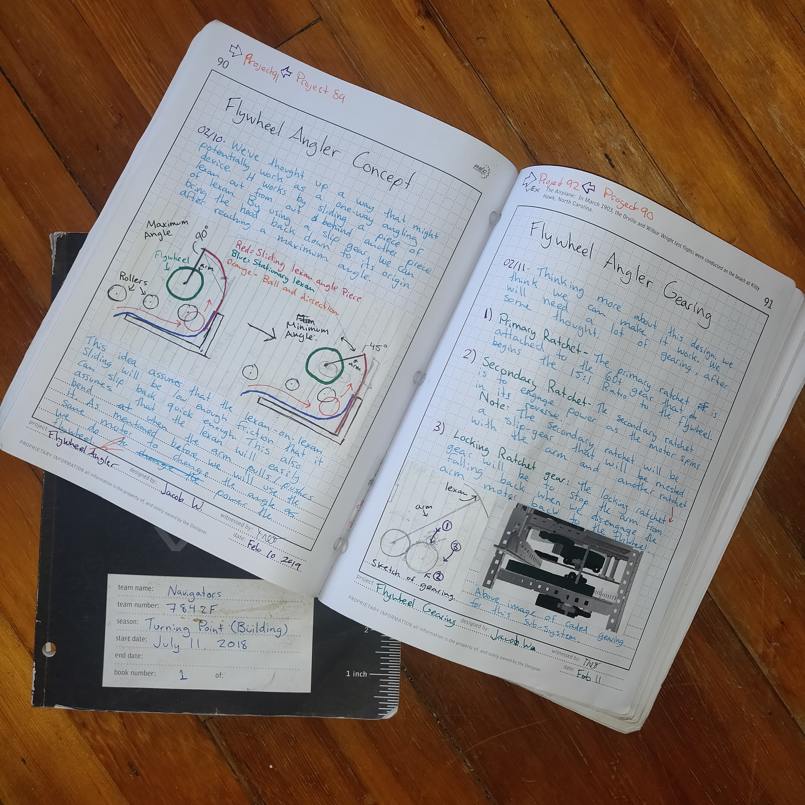

There are higher and lower-resolution versions, and the original images,
available
[here](https://drive.google.com/drive/folders/1d5pq-xX7hGxc8Jjt8pD240M9AHUl8COj?usp=sharing).
Enjoy!

# Conclusion

This season has been really fun. Jacob and I have learned a lot and made it to
Worlds together for the second time in a row. I have made huge advancements in
my programming ability and have found a passion for it.

Unfortunately for me, Jacob has graduated this year and will be going to
university. This leaves me as the team captain of a 1-person team with little
building skills. Our club leadership has stepped down, leaving the club in a
state of uncertainty. I have no idea what will happen in the following season,
but I hope I can find a new robotics partner and continue the success of 7842F.

As for programming, I plan to create a library and implement some ideas I have
been wanting to make for a while. Stay tuned!

# Contact

If anyone has any questions or comments about this post, I am more than happy to
answer them. If someone has suggestions to improve this post, let me know while
I am still able to edit!

Also, feel free to contact me about programming questions in general on Discord
at `theol0403#6480`. Just know that I will probably tell you to read
learncpp.com.

For updates, follow us on our instagram account
[7842F_vrc](https://www.instagram.com/7842f_vrc/)!

<hr>

I hope this has provided a valuable resource for future seasons and has taught
someone something. Have a great season!
