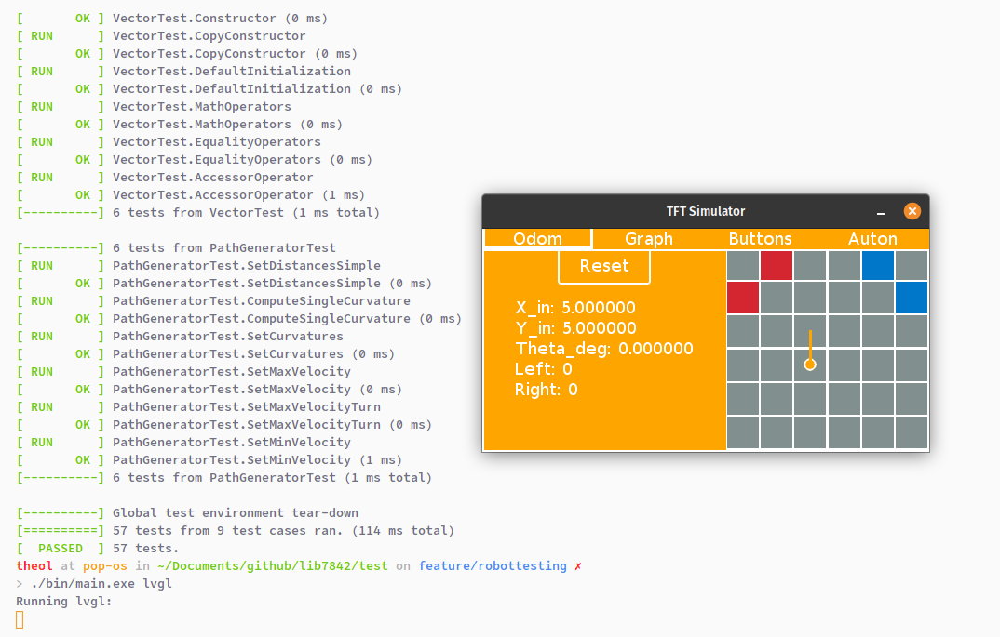

A large part of lib7842 is the GUI. It uses a third-party graphics library named LVGL for the elements. The GUI is fully tested and developed on my computer using a simulator, so that I don't need to have a V5 brain handy.

Here is a screenshot of the GUI:

