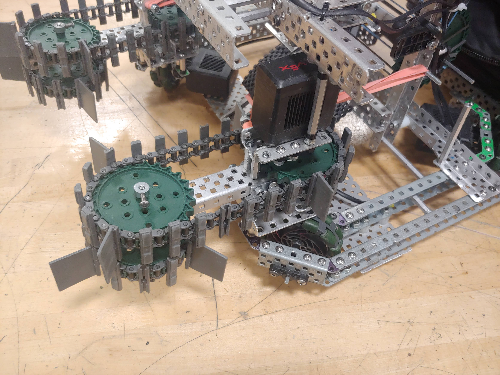
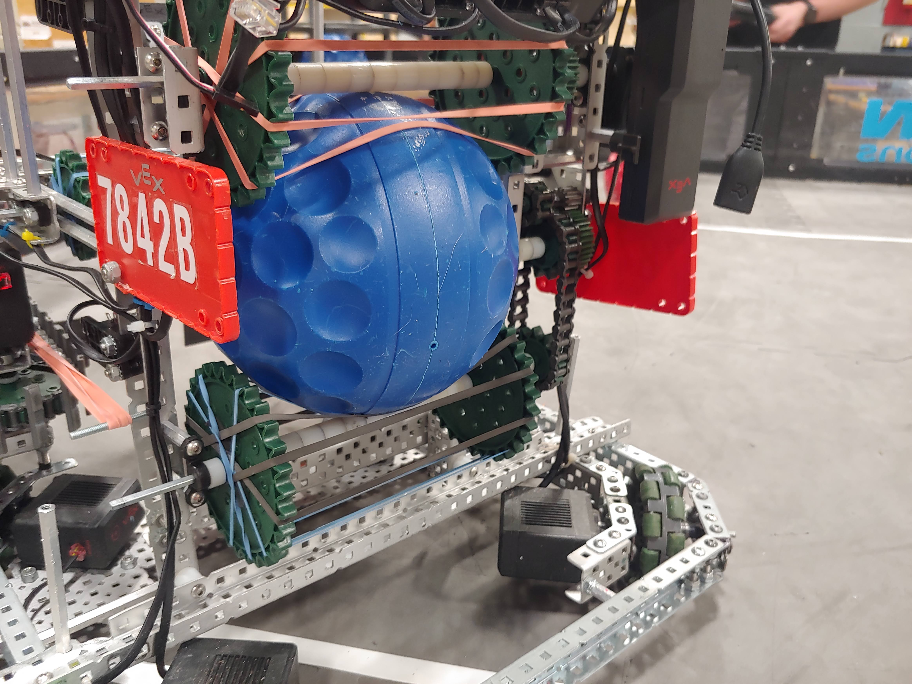
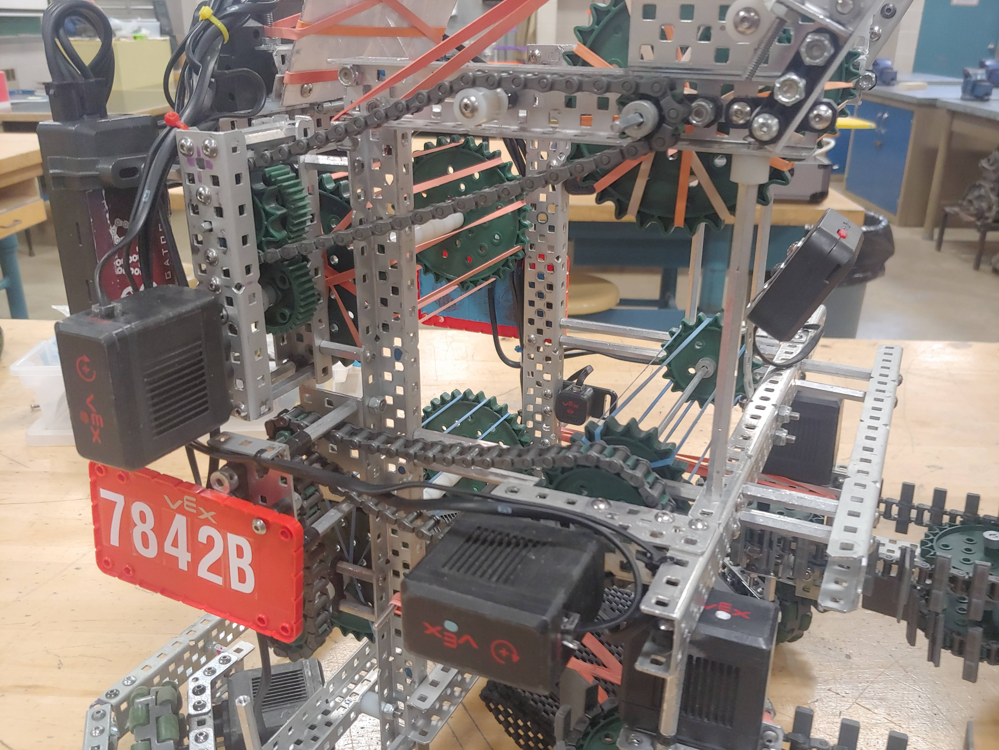
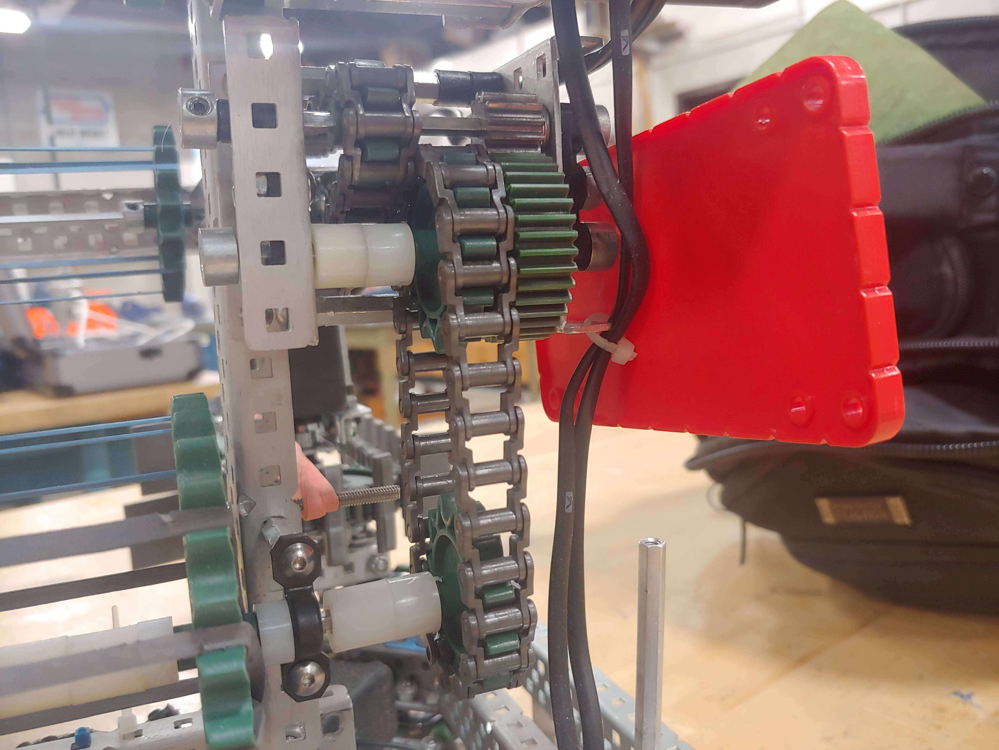
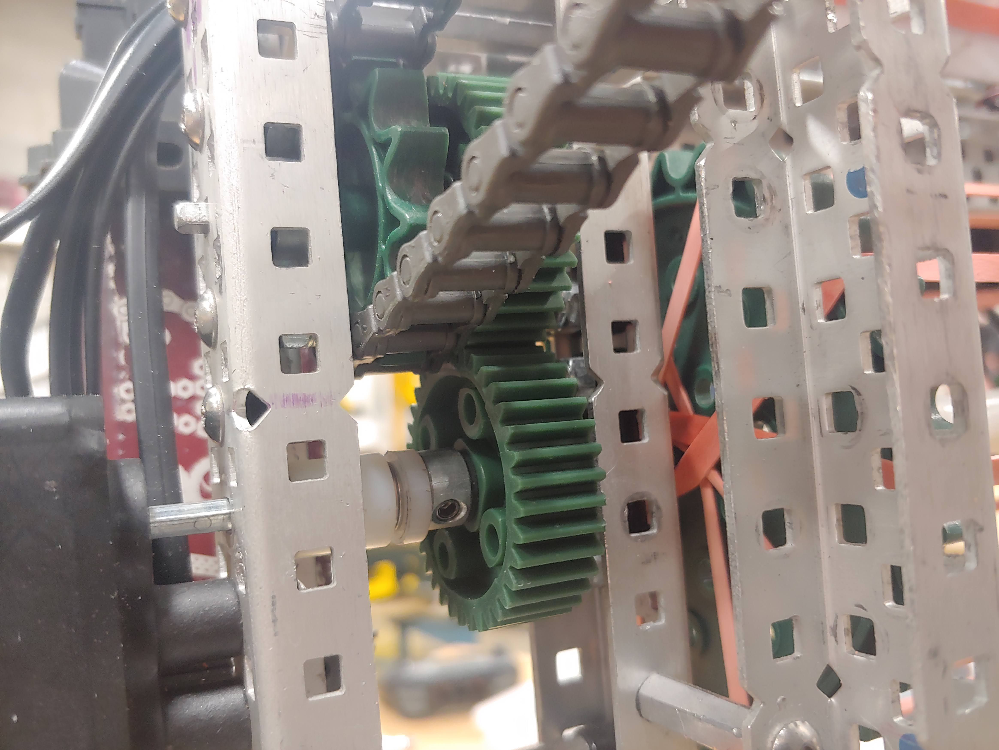
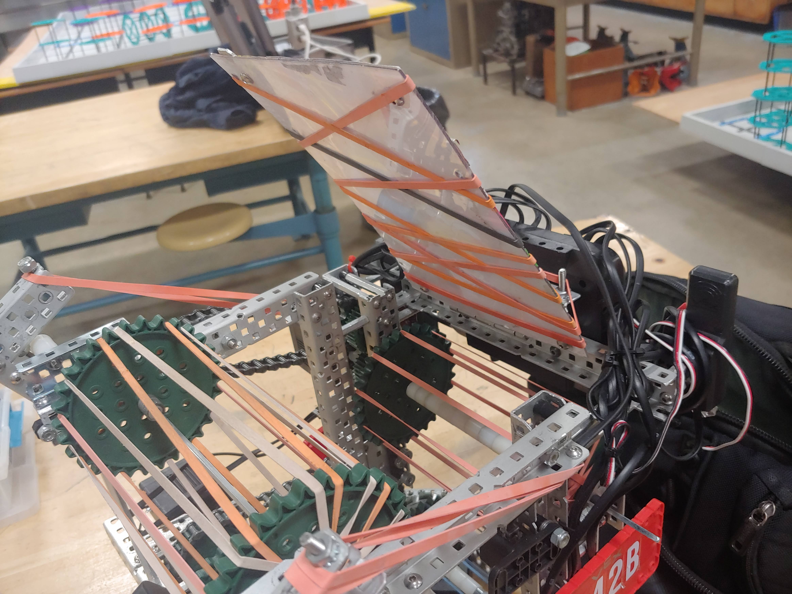

## Front Intakes

The robot was built so that the intakes could fold out to extend the reach of
the robot into the goals. This was done by using nilocks and strand-offs.

Elastics are used to pull the intakes to the front and into position. The
intakes rotate in until they hit the stopper. The stopper is made to be easily
changed for the right amount of compression on the ball. The intakes run at 200
rpm.

## Back Rollers

The robot has rollers at the back that are spaced apart so that we can get rid
of the balls out the back:

The robot uses 2 motors for the rollers that move up and shoot the balls. Since
there are 4 rollers each motor controls 2 rollers.

You can see the 4 rollers in his image:

However, since our robot gets rid of the wrong-colored balls out the back which
means they need to be able to spin opposite directions – either spit out the
ball or send it up to score with. Therefore, the back rollers must be on
different motors.

So, each one of the back rollers are connected to one of the front rollers but
the front and back need to go opposite directions to move the ball up. To run
two rollers opposite directions with one motor we made a gearbox to reverse the
rotation.

The rollers that move the ball up or out the back run at 200 rpm and the one
that shoots them runs at 600 rpm.

Lower reversing gearbox:

Upper reversing gearbox:

For shooting we made a 600 rpm roller with a hood made out of lexan and
strapping for compression:

## Intake sensors

We knew that we wanted the driver to be able to hold the "intake" button without
being worried that the robot will expel balls. Therefore, we attached light
sensors to the intake and hood which can detect the presence of a ball. This
way, we can automatically turn off the rollers when they are holding a ball.
