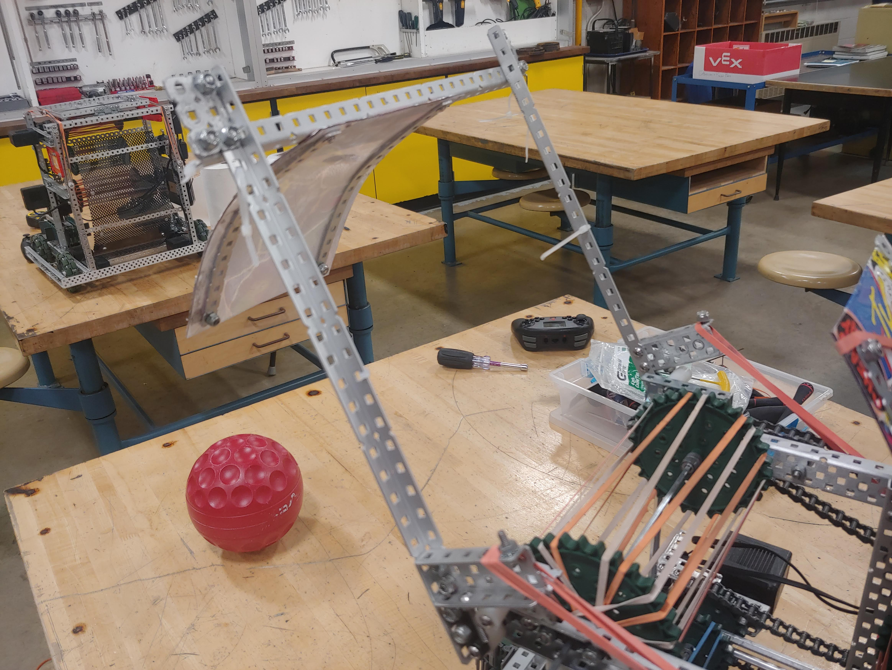

For the new robot we decided to add a deflector that directs the ball into the
goal. This majorly helps doing double shots and accuracy of the robot. Before we
added this the robot had to be very well lined up or there wa a chance the ball
would miss. Specifically on the centre goal which doesn't have a backplate.

