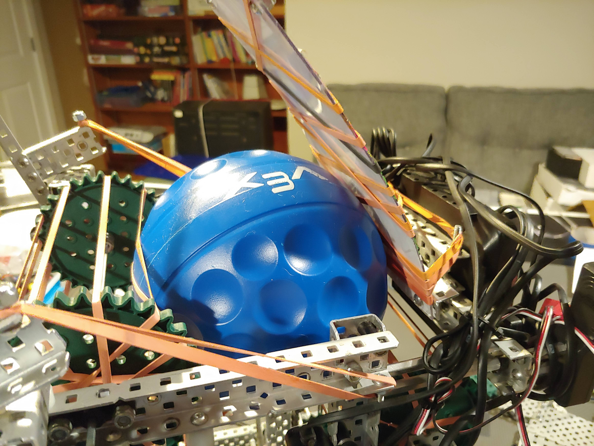

### New Hood

The original hood that put compression on the ball to shoot but was not very
secure, so we changed the hood to a more solid position. The hood is attached
with a hinge and has a solid stop place which in theory should help shoot
better.

### Hood Problems

When we remade it we made it have less compression on the ball since the made
the shooting roller have more speed and less strength. We had some issues
getting the right compression to be able to shoot fast enough but not to much
that it would get jammed. We tried a few different thing to try to solve it like
bending down the hood to increase compression and lowering the amount of
elastics on the roller but it wasn't working.

Then we had the idea of taking a slow-mo video of the robot shooting. We saw in
the video the ball was spinning for a short amount of time at th bottom of the
hood so it was not getting launched as far as it should so we moved the hole
hood forward and bent back the hood so it had more compression at the bottom an
the same at the top.

<iframe width="560" height="315" src="https://www.youtube-nocookie.com/embed/HAN5MYldAOk" title="YouTube video player" frameborder="0" allow="accelerometer; autoplay; clipboard-write; encrypted-media; gyroscope; picture-in-picture" allowfullscreen></iframe>
