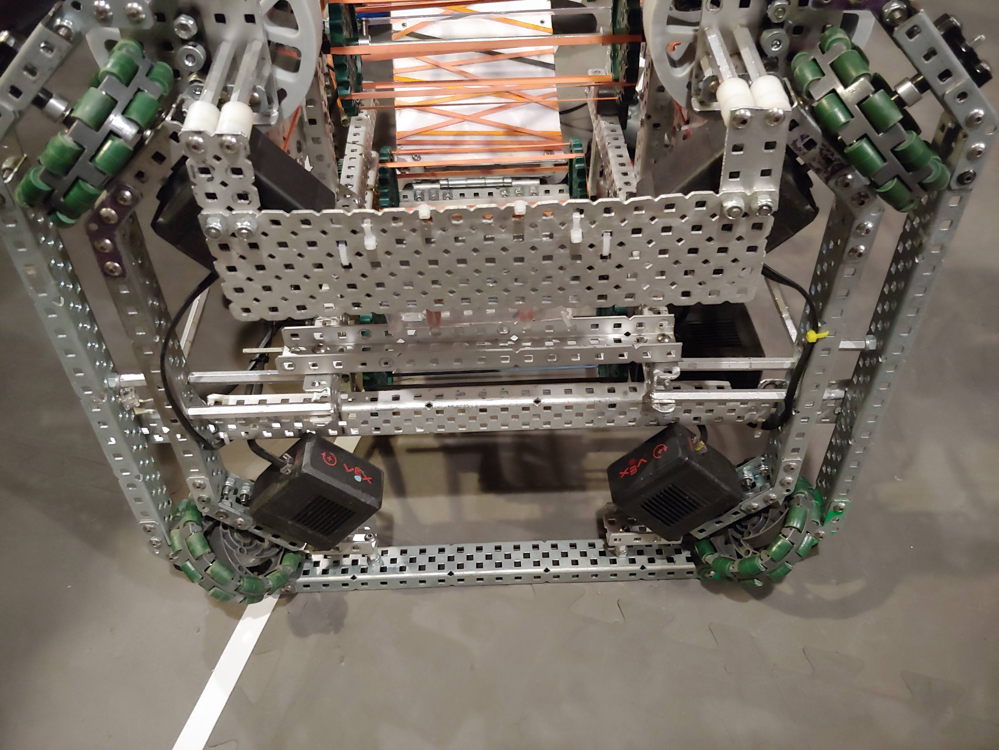
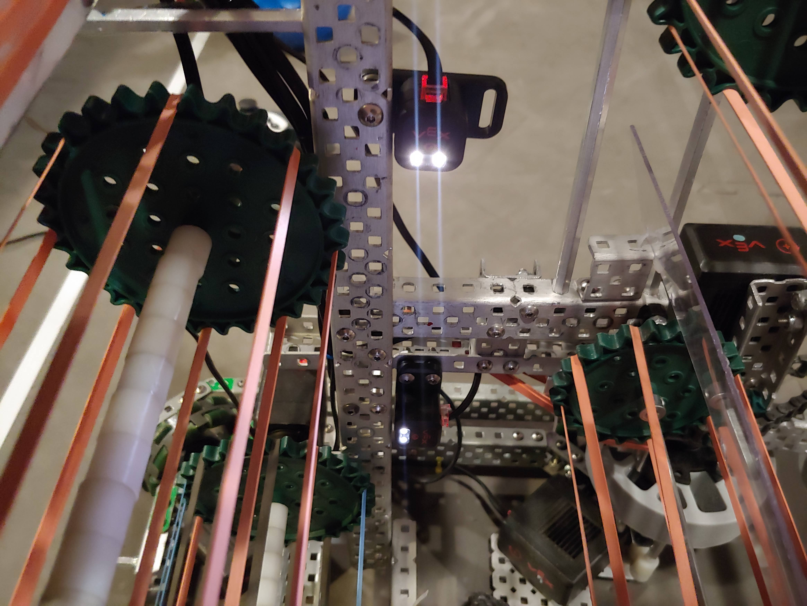

## Intakes

For the new robot we decided to speed the intakes and shooting up. We made the
top roller that shot the ball faster and lowered the amount of compression on
the ball. This made it shoot better and not take as much pressure to shoot. We
changed it to 1200Rpm. We also increased the rest of the intake and other roller
speed to 600Rpm. This made the time to intake and score a lot faster.

## Base

We also changed the wheels from 2.75 inch to 3.25 so that we could have higher
speed to be able to do a full skills run.

## Intake sensors

Even though the light sensors were very effective at managing the intakes, we
needed more information to remove driver work. We replaced both the light
sensors with color sensors, which allows us to see the colors of the balls. This
can let us add features like "auto poop", "double shot", "cycle and hold", where
the robot needs to know which balls are at what roller.

