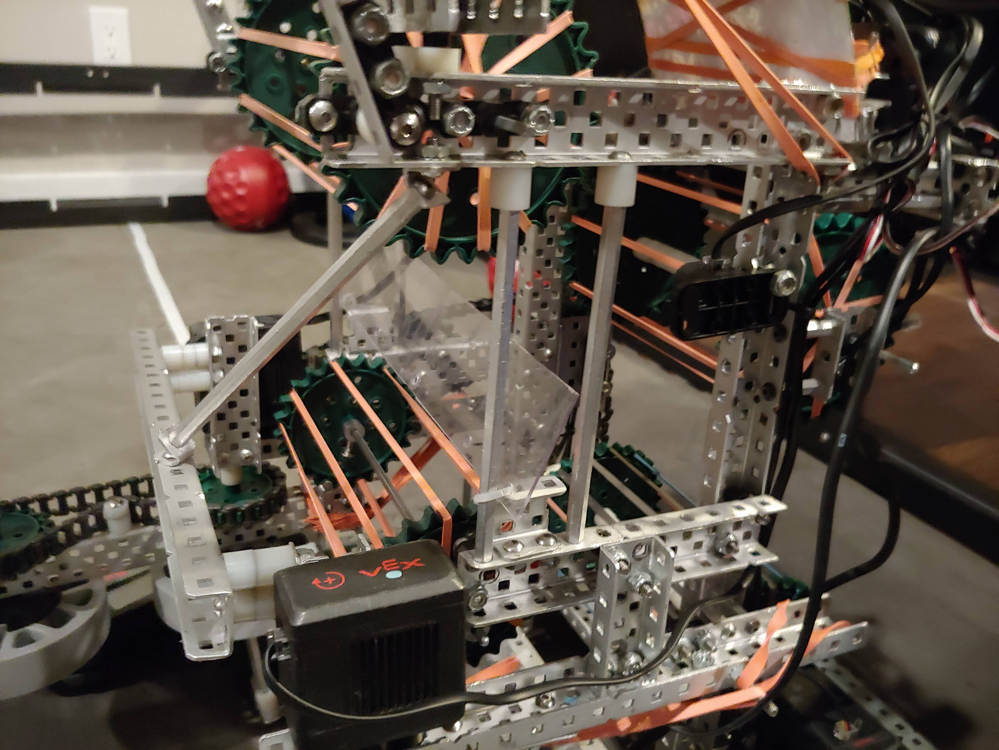

We changed the middle roller to a bigger size and moved it down because with the
new intake design it didn't bring the ball as high as with the old intake.

Since we changed to using flex wheels it doesn't push the ball as high since the
old intakes had flaps that pushed it up more.

We also made the intake much more secure with more supports and a stronger
design.
