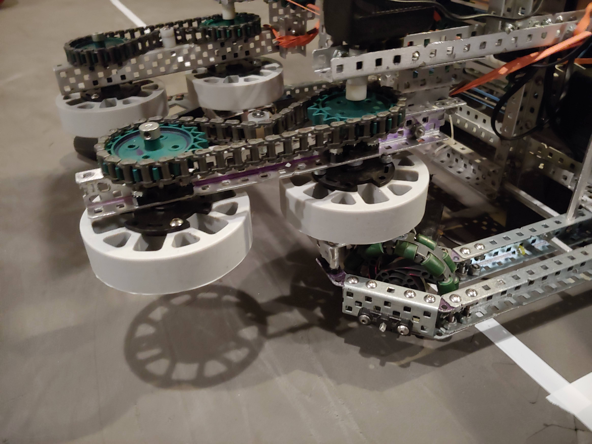

We changed the intake from treads to the new flex wheels so that its able to
intake balls out of the center goal. This saves us a lot of time on completing
the center goal.

We also changed it from rotating on a standoff to having a solid motor with the
wheels rotating on the axel. Having the motor solid makes the hole intake much
more secure.
