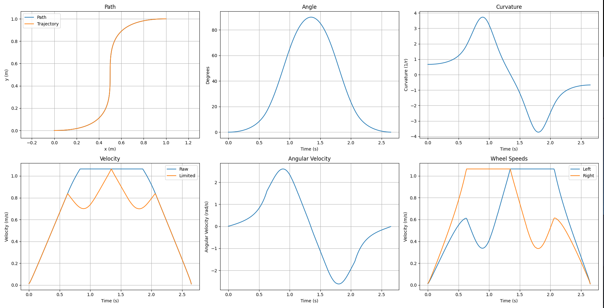
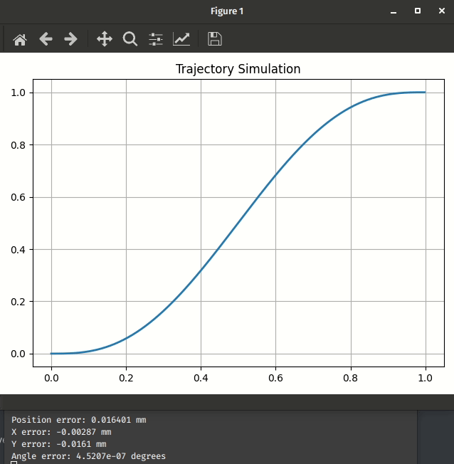

The trajectory generator is complete and very performant!

{: .noshadow}

The theoretical error is quite small, with fractions of a millimeter. Generation
times, especially when done iteratively, are very fast.

First test on the robot:

<iframe width="560" height="315" src="https://www.youtube-nocookie.com/embed/wi1XLm1SJWg" title="YouTube video player" frameborder="0" allow="accelerometer; autoplay; clipboard-write; encrypted-media; gyroscope; picture-in-picture" allowfullscreen></iframe>
