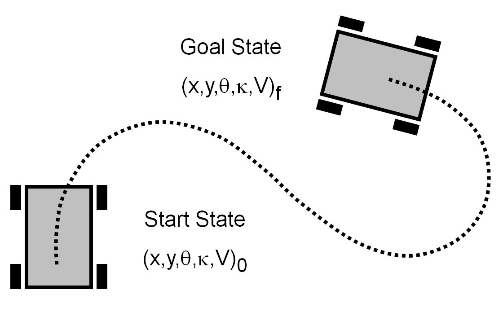
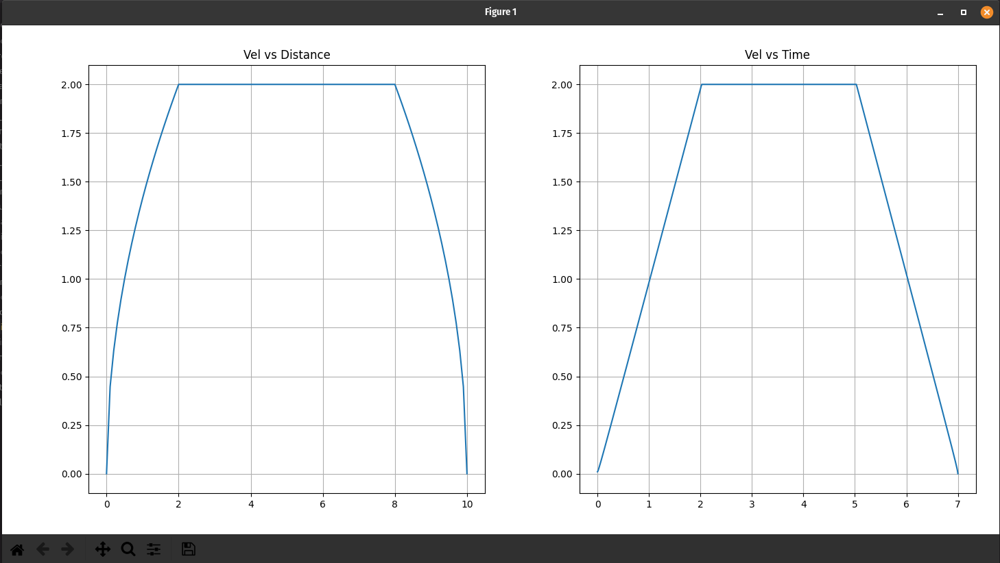

<!-- prettier-ignore-start -->
## Table of contents
{: .no_toc .text-delta }
1. TOC 
{:toc}

<!-- prettier-ignore-end -->

## Objectives

First, let's define some objectives for our generator:

- We want to develop a trajectory generator that will take a spline as an input
  and output a list of wheel speeds
- We want to respect the robot's kinematics (top motor speed and acceleration)
- We want the output to be as smooth and accurate as possible
- We want the generator to be fast enough that we can regenerate _while
  following_

## Existing Work

Similar projects have been created:

- [WPILib](https://docs.wpilib.org/en/stable/docs/software/advanced-controls/trajectories/trajectory-generation.html)
- Pathfinder
  - [Pathfinder 1](https://github.com/JaciBrunning/Pathfinder)
  - [Pathfinder 2](https://github.com/GrappleRobotics/Pathfinder)
- [Sqiggles](https://github.com/baylessj/robotsquiggles)

However, this project attempts to beat them all, both in theoretical accuracy
and generation speed.

## Basic Explanation

A trajectory generator is made by combining many steps together to form a final
product.

### 1D Motion

Let's say we want the robot to drive a specific **distance** in a **straight
line**. How can we do this **without sensors**? How can we make the motion
smooth and accurate?

{: .noshadow}

The solution is called a **motion profile**. A motion profile plans the
**velocity** of the robot over **time** while respecting **kinematics** (top
motor speed and acceleration).

Specifically, whe want to use a **trapezoidal** motion profile. In such a
profile, the robot **accelerates**, **cruises** at full speed, then
**decelerates**. We can solve this profile in such a way that the robot travels
a specific distance (area under the graph).

{: .noshadow}

### 2D Motion

How can we apply a motion profile to a spline? If we analyze how we want the
robot to drive:

- Start: we want to start at 0 velocity and accelerate
- Middle: we want to be moving at the maximum speed possible
- End: we want to decelerate to 0 velocity

What if we map the distance along the spline to the distance of the motion
profile?

First we need the motion profile to be a function of distance, not time. That
way, we can look at our progress along the spline, and we can find out what
velocity we should be travelling at!

Finally, we have all the tools we need to start the main algorithm:

- Measure the length of the spline, and solve a motion profile for that distance
- Start at the beginning of the spline
- What velocity should I be moving given the distance travelled?
- What is the curvature of the spline?
- Given the formula
  $$
  angular\_velocity = linear\_velocity \cdot curvature
  $$
  , what is my angular velocity?
- Record the linear and angular velocity at $$time=0$$
- Wait $$0.01s$$, then $$delta\_distance =
          linear\_velocity * 0.01$$
- Move $$delta\_distance$$ along the spline
- Repeat at new distance

If we can implement all these steps, we can achieve the fundamental structure of
the trajectory generator!

### Major Challenge

The hardest part about this project is the following:

- Given a spline, what is its arc length?
- Given a spline, what new value of $$t$$ do I use after I've traveled a certain
  distance?

Recall that a spline is $$(x, y)$$ as a function of $$t$$, in the range
$$[0, 1]$$.

The only way to find arc length of any subset of a spline is extremely
inefficient. It involves moving $$t$$ in very small increments, and measuring
the distances between each point along the spline. After summing the distances,
we have the arc length. This takes **seconds** of time.
