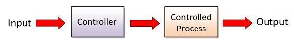

<!-- prettier-ignore-start -->
## Table of contents
{: .no_toc .text-delta }
1. TOC 
{:toc}

<!-- prettier-ignore-end -->

## Reflection

To execute any autonomous routine, the robot needs **movement algorithms**.
These are functions that use sensors, controllers, and kinematics to move the
robot somewhere.

My focus in VEX has been developing such algorithms:

- 2018: [Tank drive odometry
  PID]({{ site.url }})
  (taken from
  [here]({{ site.url }}#odometryautonomous))
- 2019: [X drive odometry
  PID]({{ site.url }})
- 2019: [Pure
  Pursuit]({{ site.url }})

All these algorithms can achieve various motions and require odometry. However,
they all have various weaknesses.

### Odometry

The main use of odometry is to unlock many possibilities of motion control. This
is because you now have access to much more information that you can feed into
the algorithms. For example, if you know the coordinates of the robot, and you
want to drive to some other coordinate, it is trivial to calculate position and
orientation error and then use PID-based algorithms to minimize that error.

Odometry, however, is a tricky task:

- it drifts a ton
- it requires a robot designed with perfectly calibrated tracking wheels
- it requires much tuning
- it is sensitive to rocking, vibrations, etc

### Closed-loop issues

Assuming the robot has perfectly tuned odometry, you still run into issues. This
is because anything directly using odometry is inherently a **closed loop
controller**. This means that the controller's **output** is a direct function
of the robot's **error** (calculated from **state**).

While this theoretically seems like a good thing, as the robot can use sensors
to correct for disturbances and errors, consider some realities:

- in VEX (especially skills), there is nothing that will interfere with the
  robot
- if something is wrong, misalligned, or stuck, odometry can't fix that
- using vex sensors for localization is not accurate, fast, or smooth

Instead, what ends up happening is that **odom introduces noise and variance**
into the controller, in a vicious cycle of tracking error -> correction -> more
error -> **unpredictable error**.

Is the definition of smooth, consistent control "do the exact same thing every
time", or "aggressively minimize error until the sensors say you are at your
destination"? I believe it is the former.

## Requirements

Is there a way to achieve the benefits of odometry (more complex and versatile
algorithms) without being overreliant on sensors?

I need to develop a motion algorithm that matches the following criteria:

- follow any arbitrary path that is represented by a mathematical function
- use robot kinematics and math to ensure smooth, consistent control **by
  default**
- remove a dependence on difficult and noisy sensors
- support **sensor augmentation** which can use sensors to **correct, not
  steer**

This season, driving complex paths will be very useful. Therefore, while moving
in straight lines/arcs is useful, we need more.

Specifically, we want the robot to follow a **parametric spline**. A parametric
spline is a function that gives $$(x, y)$$ as a function of $$t$$.

{: .noshadow}

We need to design an algorithm that takes a **spline** as an input and outputs
**motor voltages** for each side of the robot.

## Solutions

### Pure Pursuit

One option is [Pure
Pursuit]({{ site.url }}), an
algorithm that uses odometry to project a point along a spline for it to "seek".

However, since pure pursuit is a closed-loop controller that takes the robot's
current state, measured by sensors (position, speed), and calculates how the
robot should move, it falls into the problems with closed-loop control mentioned
above - namely this it is unstable, unpredictable, inconsistent, and not smooth.

### Open Loop Control

What if we made an algorithm that generates wheel velocities for the robot to
follow exactly:

- An open loop controller plans how it will move ahead of time.
- The motion is guaranteed to be smooth, consistent, optimal, and therefore
  repeatable
- Any tracking error will often be repeatable

However, this means we need to be more deliberate with the calculations. Any
errors won't be compensated for. If the smooth control is not consistent enough,
sensors can be used to correct the motion.

In short, we want to design a **trajectory generator**, where the input is a
spline, and the output is wheel velocites.
