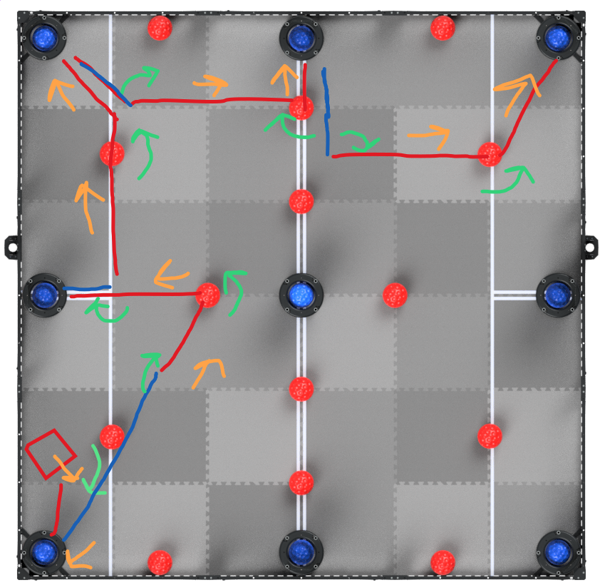

We have about 2 days to write a programming skills run. We are starting from
scratch, apart from a skeleton of a 3-ball routine. However, the algorithms have
changed and distances will not be the same as before.

Currently, we can only move in straight lines. It is using the 2D motion profile
codebase, but there is an issue with following a spline. Therefore, we will only
feed it lines, effectively turning it into a 1D motion profile.

The current rough plan:

Hopefully, we will be able to pull this off for the Feb 6 competition.

## Update Feb 6

The routine exeeded our expectations, by actually scoring decently well! We
managed to program all the steps in our plan. It missed a few goals at the
competition, but by shooting for a higher number of goals than before, we won
the competition and beat a personal best!

Here is a successful practice run:

<iframe width="560" height="315" src="https://www.youtube-nocookie.com/embed/Sm_SCR62IUE" title="YouTube video player" frameborder="0" allow="accelerometer; autoplay; clipboard-write; encrypted-media; gyroscope; picture-in-picture" allowfullscreen></iframe> 

At this competition, we learned a lot, like the importance of planning where to
poop, the need for some extra sensors for consistency, and generally what needs
to be done to improve the autonomous.
