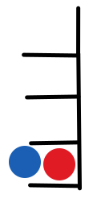

<!-- prettier-ignore-start -->
## Table of contents
{: .no_toc .text-delta }
1. TOC 
{:toc}

<!-- prettier-ignore-end -->

For the competition of March 6, we plan to score all the goals. This would grant
us a massive score thanks to completing all the combos.

However, some improvements need to be made from the last autonomous:

- the starting orientation was not ideal, and it often caused the robot to knock
  the nearby ball into the way
- at this point, the motion algorithms now support strafing and arcing, making
  many more routes possible
- vision sensor alignment has been implemented, and seems to be very effective
  at improving consistency
- planning locations where the robot poops is very important to ensure the field
  is in a consistent state
- improving the intake timing is key to a consistent autonomous

## The new routine

Keeping all the above points in mind, here is the new routine, where
<span style="color: #e11720; font-weight: bold">red</span> is forward,
<span style="color: #135bb5; font-weight: bold">blue</span> is backward,
<span style="color: #34d07a; font-weight: bold">green</span> is turning, and
<span style="color: #9141ac; font-weight: bold">purple</span> is strafing:

{: .noshadow}

In total, there are 13 point turns. Notice the use of the new algorithm for
smooth arcing to the goal.

This autonomous builds upon v1, but introduces some more ambitious motions: the
3 curved arcs. However, we have a week to perfect it, so it should be doable.

## Update March 3

The new routine is coming along well, and with vision sensor allignment, it is
about 90% consistent at grabbing the red balls and driving to the goals.

However, our largest source of error is from the timing of the intakes.
Sometimes it leaves a blue ball in the goal. Sometimes it takes the red ball
back out.

Iterating the entire autonomous just to tweak the intake timing was much too
slow of a process, so instead, we developed a plan:

- isolate the portion of the code responsible for a specific goal
- set the robot up at that goal and run the code
- tune the intake timing to be perfect
- repeat for each goal

This worked very well: after tuning all the intake code, our success rate went
from about 40% to 80%.

Here is a video of the complete run:

<iframe width="560" height="315" src="https://www.youtube-nocookie.com/embed/ph_FwYNPAbk" title="YouTube video player" frameborder="0" allow="accelerometer; autoplay; clipboard-write; encrypted-media; gyroscope; picture-in-picture" allowfullscreen></iframe><br>

## Update March 7

At our provincials, the autonomous was executed **perfectly**, with a score of
121... except the worst of luck struck! At one of the goals, a blue ball was
resting on the outer ledge, like so:



Even though we had descored the ball, since it was inside the perimeter of the
goal, it counted as scored. However, not only that, since it was slightly higher
than the red ball (since it was on the lip), it counted the goal as
blue-possessed. This fluke lost us 19 points!

Unfortunately, our other runs weren't perfect, so while we made a few more
points, we were unable to reach our maximum score. It was still enough for us to
win the competition, however.

We learned that we need to be careful about outtaking the balls so that they
don't jam into the goals again. We also learned about the importance of tuning
each goal individually for consistent results.

## Code

Here is the final autonomous code:

```cpp
void shootCorner() {
  roll(topOut);
  pros::delay(500);
  roll(intakeWithoutPoop);
  pros::delay(60);
  asyncTask({
    pros::delay(400);
    roll(out);
  });
}

void shootEdge() {
  roll(topOut);
  pros::delay(400);
  asyncTask({
    pros::delay(500);
    roll(intakeWithoutPoop);
  });
}

void autonomous() {

  // start facing right
  Robot::imu()->reset(90_deg);

  // deploy after strafing from edge
  move->strafe(Line({0_ft, 0_ft}, {-1.5_ft, 0_ft}));

  roll(deploy);
  pros::delay(500);
  roll(intakeWithoutPoop);

  /* ------------------------------- first corner goal ------------------------------- */

  // to ball and goal
  move->curve(Mesh({0_ft, 0_ft, 0_deg}, {1.9_ft, 3.8_ft, 70_deg}), {});

  // shoot
  roll(intakeWithoutPoop);
  pros::delay(100);
  roll(topOut);
  pros::delay(400);
  roll(onWithoutPoop);
  pros::delay(500);
  roll(off);

  // back up
  asyncTask({
    pros::delay(200);
    roll(out);
  });
  drive(-2.5_ft);

  /* ----------------------------- first edge goal ---------------------------- */

  // purge and turn
  turn(-75_deg);

  // to ball
  roll(intake);
  drive(3.75_ft, {.ball_seek = 30_pct});

  // to goal
  turn(177_deg);
  drive(3_ft, {.goal_seek = 50_pct});

  // shoot
  shootEdge();

  // back up
  drive(-0.85_ft);

  /* --------------------------- second corner goal --------------------------- */

  // purge and turn
  asyncTask({
    pros::delay(400);
    roll(poopIn);
  });
  turn(-92_deg);

  // to ball and goal
  pros::delay(200);
  roll(intake);
  move->curve(Mesh({0_ft, 0_ft, 0_deg}, {-3.4_ft, 5.75_ft, -85_deg}), {.ball_seek = 10_pct});

  // shoot
  shootCorner();

  // back up
  drive(-3_ft);

  /* ---------------------------- second edge goal ---------------------------- */

  // purge and turn
  roll(out);
  pros::delay(200);
  turn(16_deg);

  // to ball
  roll(intake);
  drive(3.2_ft, {.ball_seek = 20_pct});

  // to goal
  turn(-92_deg);
  drive(3_ft, {.goal_seek = 50_pct});

  // shoot
  roll(topOut);
  pros::delay(500);
  roll(shootWithoutPoop);
  pros::delay(500);
  asyncTask({
    pros::delay(350);
    roll(intakeWithoutPoop);
  });

  // back up
  drive(-1.6_ft);

  /* ---------------------------- third corner goal --------------------------- */

  // purge and turn
  asyncTask({
    pros::delay(400);
    roll(poopIn);
  });
  turn(-2_deg);

  // to ball
  roll(intake);
  drive(4.3_ft, {.ball_seek = 50_pct});

  // to goal
  turn(-61_deg);
  drive(3.3_ft, {.goal_seek = 50_pct});

  // shoot
  shootCorner();

  // back up
  drive(-2_ft);

  /* ----------------------------- third edge goal ---------------------------- */

  // purge and turn
  roll(out);
  pros::delay(200);
  turn(111_deg);

  // to ball
  roll(intake);
  drive(4.35_ft, {.ball_seek = 30_pct});

  // to goal
  turn(-5_deg);
  drive(3.1_ft, {.goal_seek = 50_pct});

  // shoot
  shootEdge();

  // back up
  drive(-1.2_ft);

  /* --------------------------- fourth corner goal --------------------------- */

  // purge and turn
  asyncTask({
    pros::delay(300);
    roll(poopIn);
  });
  turn(77_deg);

  // to ball and goal
  roll(intake);
  move->curve(Mesh({0_ft, 0_ft, 0_deg}, {-3_ft, 6.25_ft, -80_deg}), {.ball_seek = 10_pct});

  // shoot
  shootCorner();

  // back up
  drive(-1.6_ft);

  /* ---------------------------- fourth edge goal ---------------------------- */

  // purge and turn
  roll(out);
  pros::delay(200);
  turn(172_deg);

  // to ball
  roll(intake);
  drive(4.27_ft, {.ball_seek = 40_pct});

  // to goal
  turn(81_deg);
  drive(0.9_ft);

  // shoot
  shootEdge();
  roll(onWithoutPoop);
  pros::delay(300);

  // back up
  asyncTask({
    pros::delay(400);
    roll(out);
  });
  drive(-0.8_ft);

  /* ------------------------------- center goal ------------------------------ */

  // purge and turn
  roll(out);
  pros::delay(200);
  turn(-94_deg);

  // to ball
  roll(intake);
  drive(2_ft, {.ball_seek = 0_pct});

  turn(-97_deg);
  Timer t;
  while (t.getDtFromStart() < 0.2_s) {
    Robot::model()->xArcade((Robot::vision()->getBlueOffset()) * 0.025, 0, 0);
    pros::delay(10);
  }
  move->strafe(Line({0_ft, 0_ft}, {0.55_ft, 0_ft}));

  // move to poke
  drive(1.42_ft);
  drive(-1_ft);
  turn(-97_deg);
  move->strafe(Line({0_ft, 0_ft}, {-0.4_ft, 0_ft}));
  drive(1.4_ft);
  roll(onWithoutPoop);
  pros::delay(600);
  drive(-1_ft);
  turn(-97_deg);
  move->strafe(Line({0_ft, 0_ft}, {0.75_ft, 0_ft}));
  drive(1.3_ft);
  drive(-2_ft);
}
```
