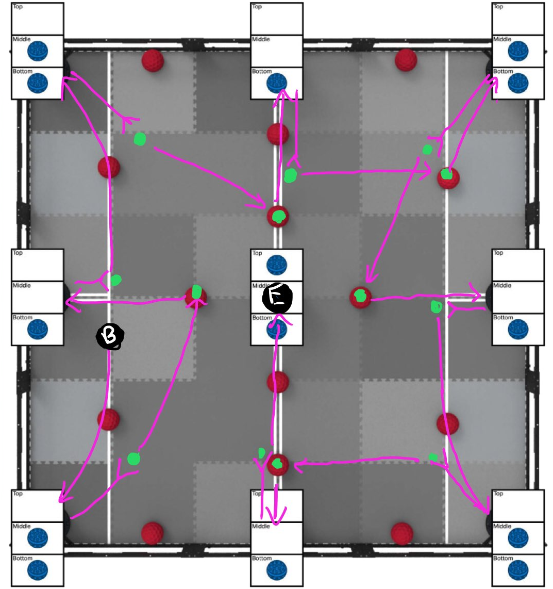

Previously, our routine was only designed to score a maximum of 122 points (out of 126), purposefully excluding 4 of the balls. It looked something like this:

Where **B** is the start, **E** is the end, and green is point turns. In this run, there are 13 point turns.

<iframe width="560" height="315" src="https://www.youtube-nocookie.com/embed/ph_FwYNPAbk" title="YouTube video player" frameborder="0" allow="accelerometer; autoplay; clipboard-write; encrypted-media; gyroscope; picture-in-picture" allowfullscreen></iframe> 

We are only slightly under time, so in order to get the last 4 balls, something needs to be different. Simply modifying the current routine to grab the last 4 balls is not possible.
