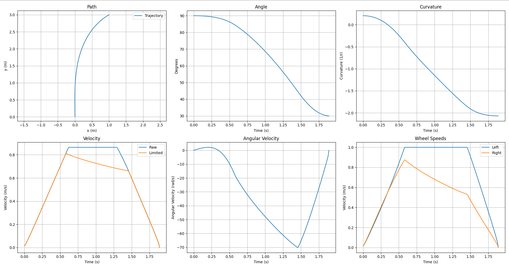

## Hybrid Arcs

For skills V2, I need to execute some specific arcs, where it drives into the
goals. While the paths can be represented by functions such as Beziers or
Hermites, it would be nice to use something simpler.

The idea of meshing two arcs together seemed like an excellent plan - you get
the simplicity of an arc with the versatility of specifying start and end
angles:

 <iframe src="https://www.desmos.com/calculator/hoevadrflf" title="Nonlinear Arc Meshing" frameborder="0" height=500 sandbox="allow-same-origin allow-scripts"></iframe>

So, I implemented it into the code.

And it worked great for the skills run!

<iframe width="560" height="315" src="https://www.youtube-nocookie.com/embed/ohYuHDp0nZQ" title="YouTube video player" frameborder="0" allow="accelerometer; autoplay; clipboard-write; encrypted-media; gyroscope; picture-in-picture" allowfullscreen></iframe>
