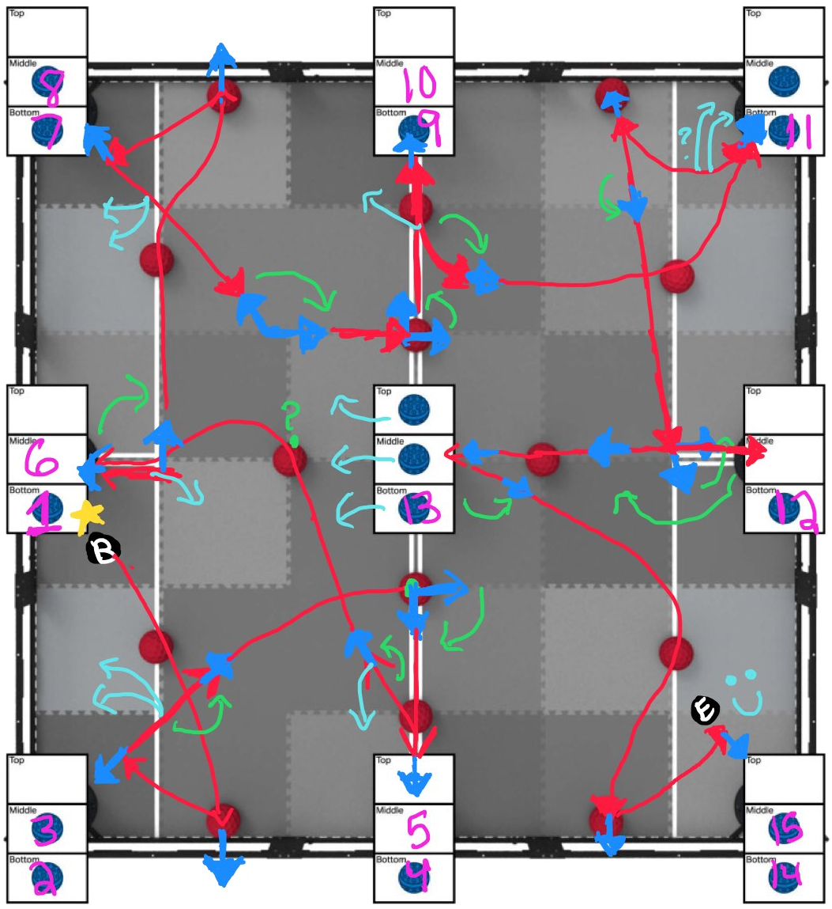

## New routine

Here are a few ways we can shave off time and make it possible to get the last 4 balls:

- Robot V3 can intake the blue balls from the center tower rather than needing to poke them out. This can save us about 8 seconds.
- Spending less time at each goal and perfecting the shoot/intake timing can save us about 5 seconds.
- Adding a hood catapult to the robot can allow us to quickly score our preload, saving us about 3 seconds
- Redesigning the entire autonomous to be more efficient, with the last 4 balls in mind, and reducing point turns, can save us about 10 seconds.

For the last point, the more complex the motions are (driving while turning, complex arcs), the more optimal the routine can be.

One possible routine:

Where **B** is the start, **E** is the end, red is translation, blue is front-facing direction, green is point turns, and light blue is potential "poop" locations. The star is a hood catapult. In this run, there are 11-12 point turns.
