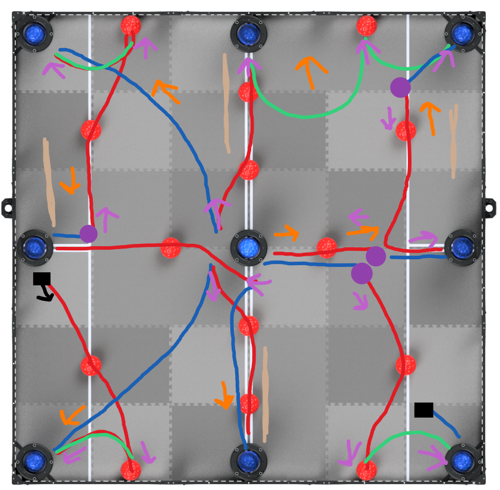

<!-- prettier-ignore-start -->
## Table of contents
{: .no_toc .text-delta }
1. TOC 
{:toc}

<!-- prettier-ignore-end -->

Previously, our routine was only designed to score a maximum of 122 points (out
of 126), purposefully excluding 4 of the balls. It looked something like this:

We are only slightly under time, so in order to get the last 4 balls, something
needs to be different. Simply modifying the current routine to grab the last 4
balls is not possible.

## New routine

Here are a few ways we can shave off time and make it possible to get the last 4
balls:

- Robot V3 can intake the blue balls from the center tower rather than needing
  to poke them out. This can save us about 8 seconds.
- Spending less time at each goal and perfecting the shoot/intake timing can
  save us about 5 seconds.
- Adding a hood catapult to the robot can allow us to quickly score our preload,
  saving us about 3 seconds
- Redesigning the entire autonomous to be more efficient, with the last 4 balls
  in mind, and reducing point turns, can save us about 10 seconds.

For the last point, the more complex the motions are (driving while turning,
complex arcs), the more optimal the routine can be.

One possible routine:

Where **B** is the start, **E** is the end,
red is translation,
blue is front-facing
direction, green is point
turns, and light blue is
potential "poop" locations. The
star is a hood catapult.

In this run, there are 11-12 point turns.

## Ambitious Plan

Here is a new ambitious plan which only has **4** point turns!

Where red is forward,
blue is backward,
green is strafing,
purple is heading,
orange is poop locations,
and beige is locations
for line-sensor alignment.

It requires:

- holonomic motion profiling (turning while driving)
- consistent velocity following
- line sensor adjustment

As long as I achieve these things in code the routine should be doable.

## Update Apr 2

I drove the autonomous routine and verified that it is in fact possible to
execute. Onwards with the plan!
