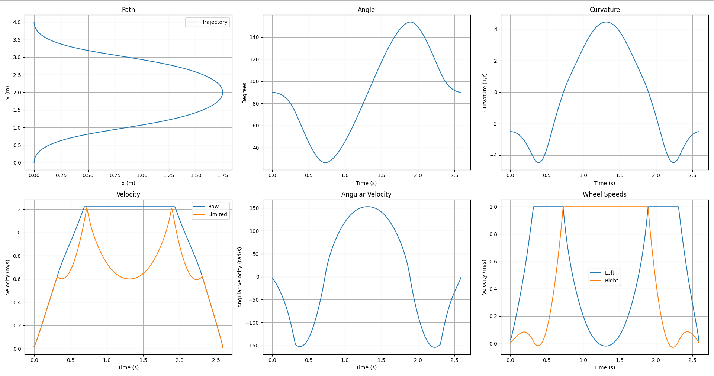
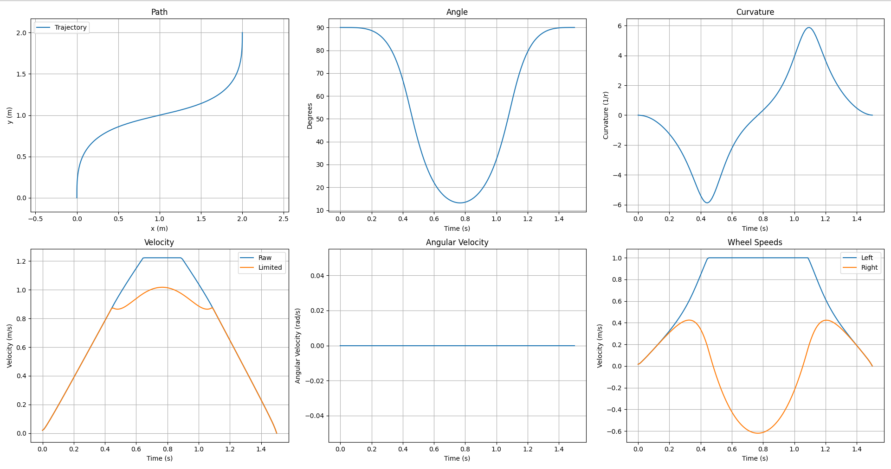

## Skid Steer Generator

After months of work, the trajectory generator is finally ready to be run on the
competition robot!

It follows a simple spline insanely well:

<iframe width="560" height="315" src="https://www.youtube-nocookie.com/embed/y16ekPgFBOk" title="YouTube video player" frameborder="0" allow="accelerometer; autoplay; clipboard-write; encrypted-media; gyroscope; picture-in-picture" allowfullscreen></iframe>

## XDrive Generator

I modified the code to support X drives. It actually was able to simplify a bit,
because the X-Drive is able to follow the path much easier.

Here is an output of the x-drive trajectory generator:

And some robot testing:

<iframe width="560" height="315" src="https://www.youtube-nocookie.com/embed/xGOi-AgqYX4" title="YouTube video player" frameborder="0" allow="accelerometer; autoplay; clipboard-write; encrypted-media; gyroscope; picture-in-picture" allowfullscreen></iframe>
