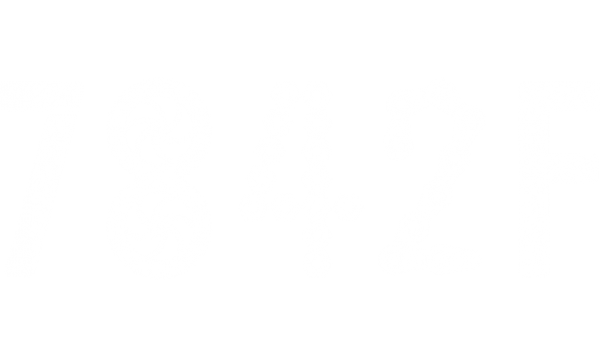

# 7842F Programming Journal

Hello, I'm Theo, the programmer for team 7842F. This is my journal where I will keep programming logs of my progress and ideas.

**Journal Layout:**

Daily logs will be kept in `Logs/`.
Concepts and ideas will be kept in `Concepts/`.
lib7842 development logs will be kept in `lib7842/`.
Code dumps will be kept in `Code/`.

